> The demonstration watermark style is not the final effect, and the final rendering result depends on the corresponding
> file. 
> 演示水印样式并非最终效果，最终渲染结果需看对应文件。

# CENTER/居中

<table>
    <tr>
        <th rowspan="2">subType/子类型</th>
        <th colspan="3">result/结果</th>
    </tr>
    <tr>
        <td style="text-align: center;">single-text/单行文本</td>
        <td style="text-align: center;">multi-text/多行文本</td>
        <td style="text-align: center;">image/图片</td>
    </tr>
    <tr>
        <td>VERTICAL_CENTER/垂直居中</td>
        <td>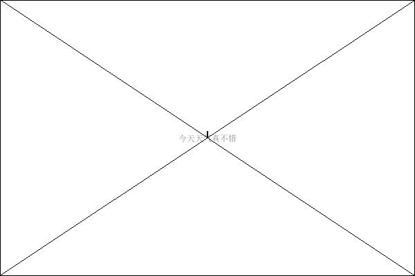</td>
        <td>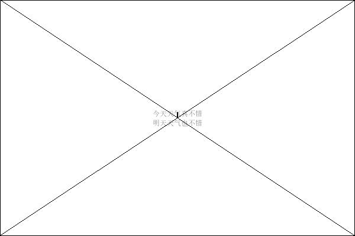</td>
        <td>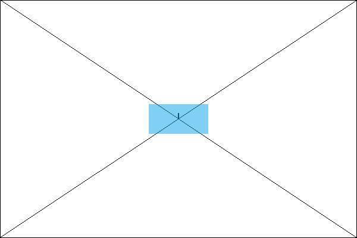</td>
    </tr>
    <tr>
        <td>LEFT_CENTER/左居中</td>
        <td>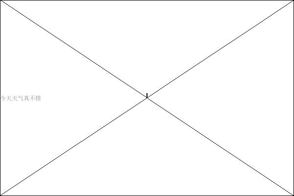</td>
        <td>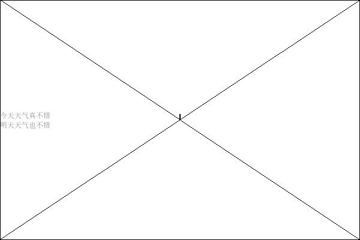</td>
        <td>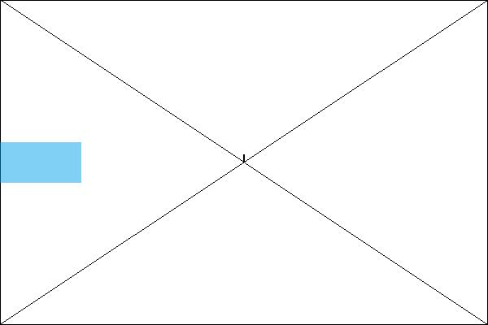</td>
    </tr>
    <tr>
        <td>RIGHT_CENTER/右居中</td>
        <td>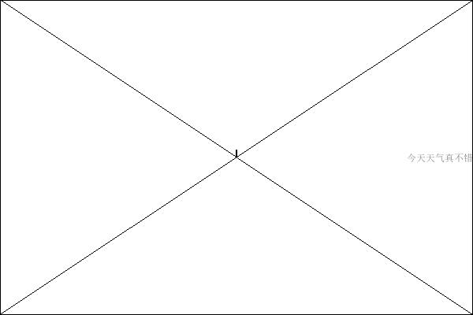</td>
        <td>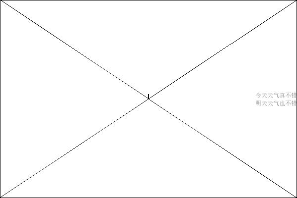</td>
        <td>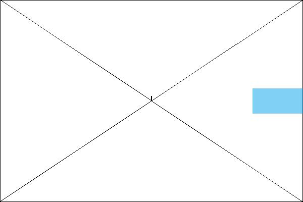</td>
    </tr>
    <tr>
        <td>TOP_CENTER/上居中</td>
        <td>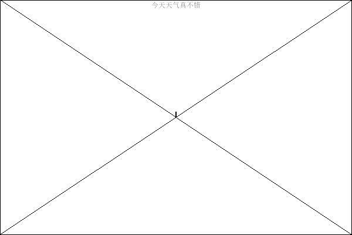</td>
        <td>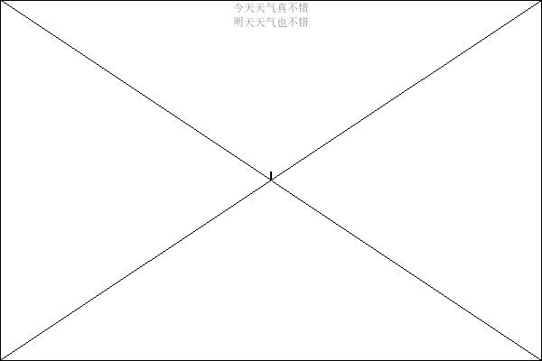</td>
        <td>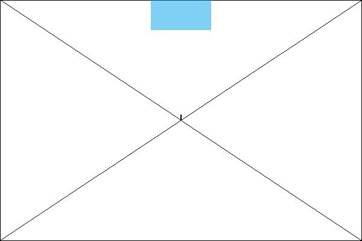</td>
    </tr>
    <tr>
        <td>BOTTOM_CENTER/下居中</td>
        <td>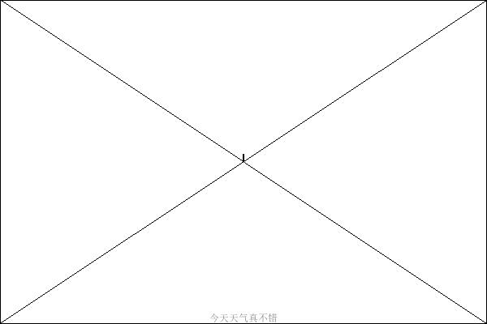</td>
        <td>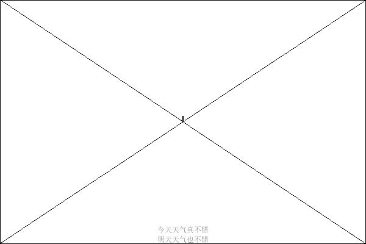</td>
        <td>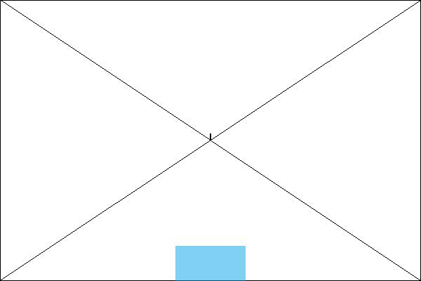</td>
    </tr>
</table>

# DIAGONAL/斜对角

<table>
    <tr>
        <th rowspan="2">subType/子类型</th>
        <th colspan="3">result/结果</th>
    </tr>
    <tr>
        <td style="text-align: center;">single-text/单行文本</td>
        <td style="text-align: center;">multi-text/多行文本</td>
        <td style="text-align: center;">image/图片</td>
    </tr>
    <tr>
        <td>TopToBottom/从上到下</td>
        <td>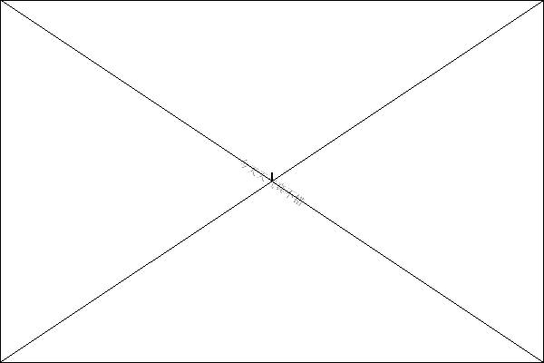</td>
        <td>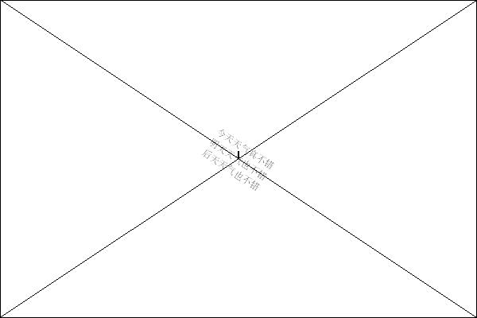</td>
        <td>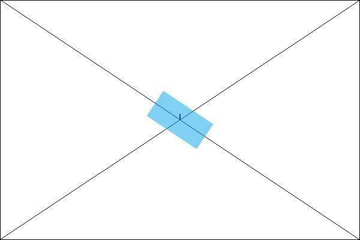</td>
    </tr>
    <tr>
        <td>BottomToTop/从下到上</td>
        <td>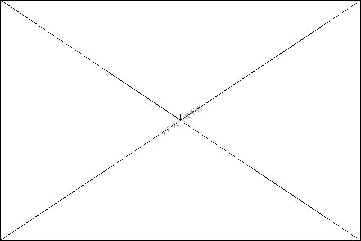</td>
        <td>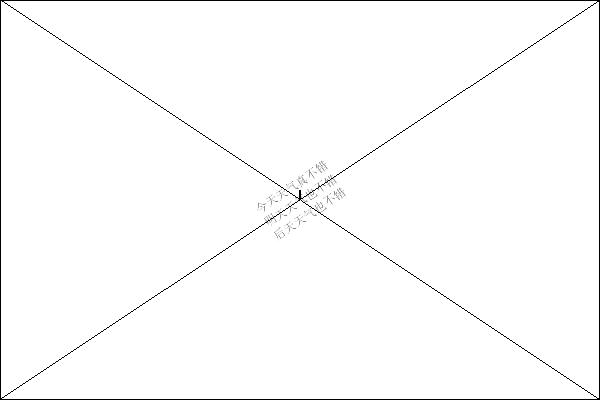</td>
        <td>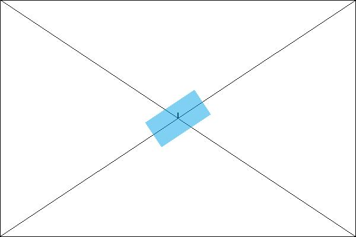</td>
    </tr>
</table>

# OVERSPREAD/铺满

<table>
    <tr>
        <th rowspan="2">subType/子类型</th>
        <th colspan="3">result/结果</th>
    </tr>
    <tr>
        <td style="text-align: center;">single-text/单行文本</td>
        <td style="text-align: center;">multi-text/多行文本</td>
        <td style="text-align: center;">image/图片</td>
    </tr>
    <tr>
        <td>LOW/低</td>
        <td>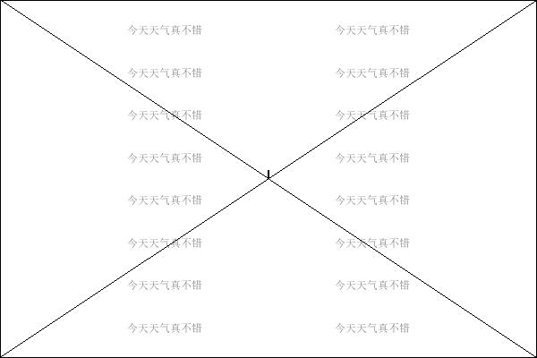</td>
        <td>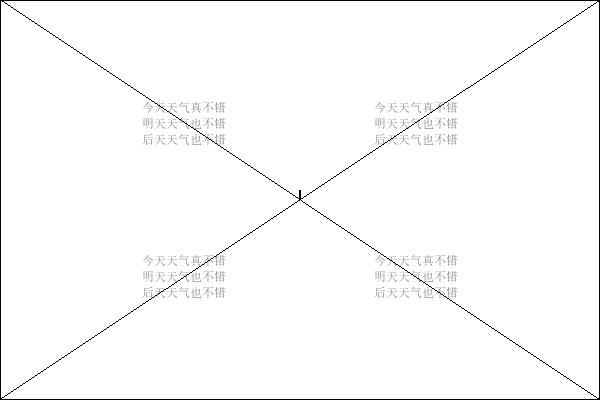</td>
        <td>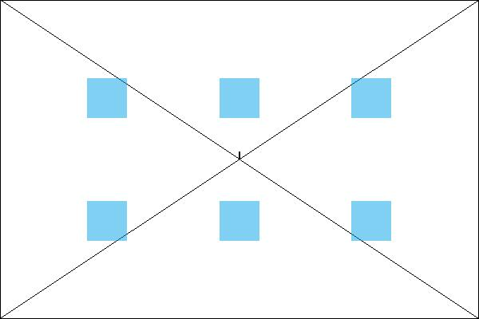</td>
    </tr>
    <tr>
        <td>NORMAL/中</td>
        <td>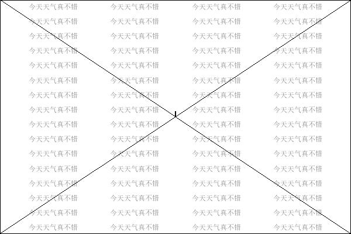</td>
        <td>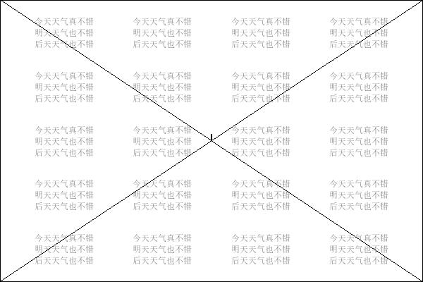</td>
        <td>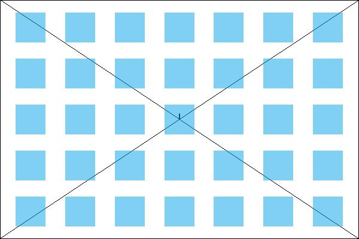</td>
    </tr>
    <tr>
        <td>HIGH/高</td>
        <td>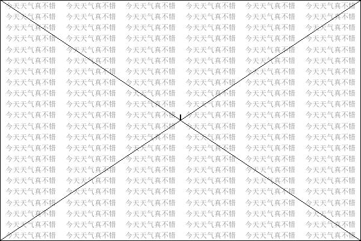</td>
        <td>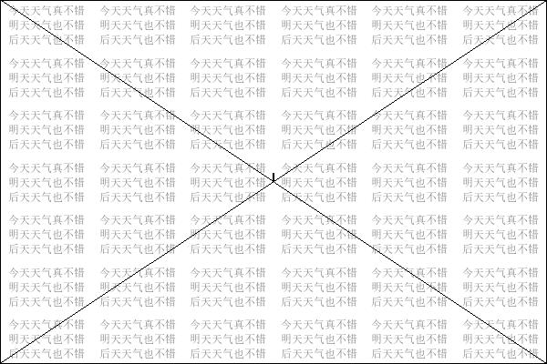</td>
        <td>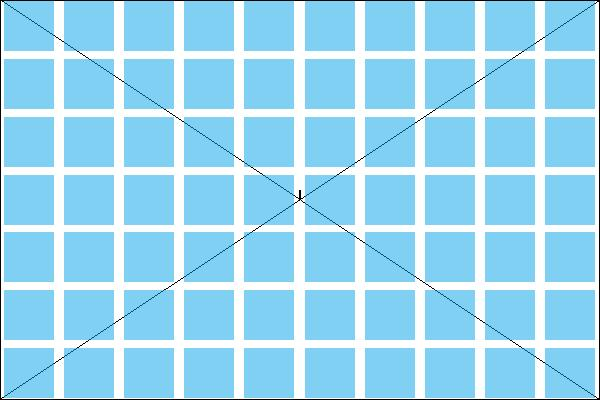</td>
    </tr>
</table>

## Add Rotation/添加旋转

<table>
    <tr>
        <th>subType/子类型</th>
        <th colspan="3">result/结果</th>
    </tr>
    <tr>
        <td style="text-align: center;">rotation/角度</td>
        <td style="text-align: center;">single-text/单行文本</td>
        <td style="text-align: center;">multi-text/多行文本</td>
        <td style="text-align: center;">image/图片</td>
    </tr>
    <tr>
        <td>30°</td>
        <td>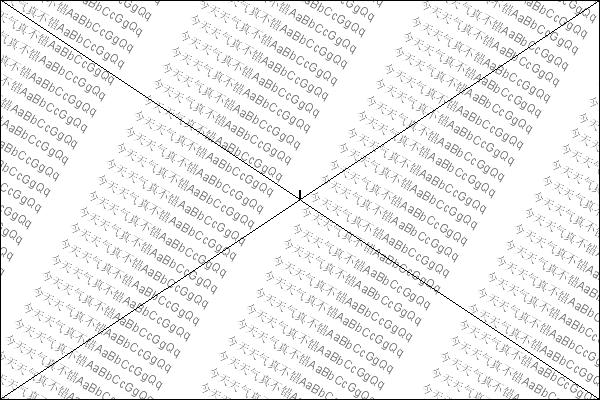</td>
        <td>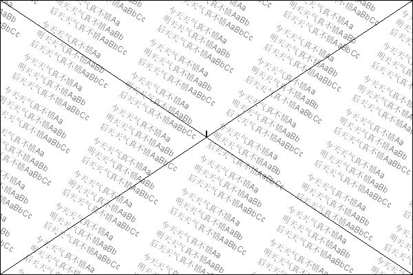</td>
        <td>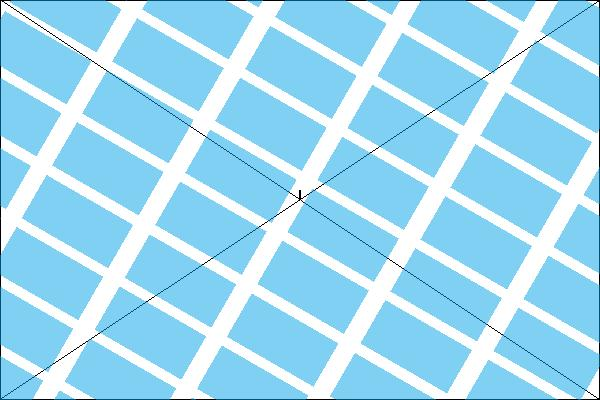</td>
    </tr>
    <tr>
        <td>150°</td>
        <td>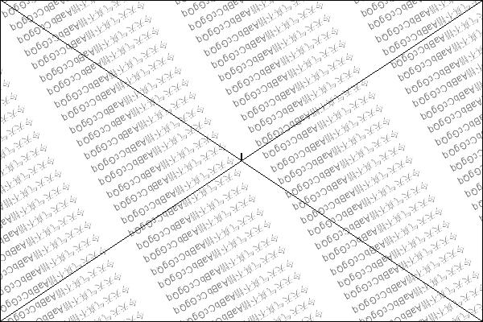</td>
        <td>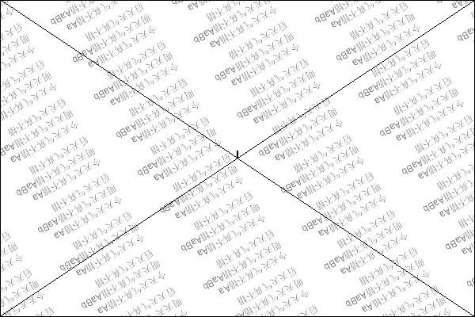</td>
        <td>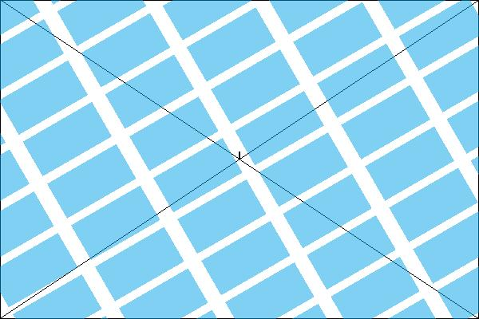</td>
    </tr>
</table>